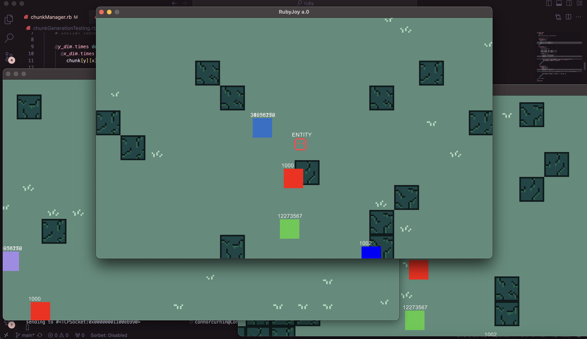

##  RubyJoy - 2D Multiplayer Game Engine 

Building a lightweight game engine in Ruby for creating simple multiplayer games.



### client.rb
Simple TCPSocket that sends and receives data.
### server.rb
Simple TCPServer that sends and receives data and stores information about server-side or "overworld" entities.
### ui.rb
Gosu UI that allows player to control movement. Each instance of the UI creates an instance of the client and connects to the server. The ui uses the client to send position, "player name" (id), and color data to the server. It also sends data to the server if it has "killed" an overworld entity (triggered by collision). The ui reads data from the server to see if any of the other connected clients have killed an overworld entity.
### entity.rb
Simple abstraction for entity, but will need to be abstracted further up (current version more closely represents a player)
### spritesheet.rb
Simple spritesheet class, needs to be cleaned up, but works within entity class.
### tilesheet.rb
Similar to the spritesheet class, but takes tilemap in. 2d array is used to draw tiles based on tilesheet. This 2d array will be stored server side.
### camera.rb
Small camera class built on top of Gosu.translate that focuses on the passed object (in this case, the player/entity).
### chunkManager.rb
Randomly generates chunks (fully random right now, will change to simplex noise) and stores chunks. Only the 9 relevant chunks are loaded on each update. Chunks are called back as they become relevant.

----

Move server and client data handling into hash maps that map to functions:

```
@handling_map = {
    "<message[:type]>" => [:<handle_method>, <message[:data]>]
}
```

Ideas for the chunk manager and multiplayer.
* Chunk manager can be server side - all players that join the server will read from the same chunks, and if they discover a new chunk, their client will report it back to the server.
* Chunk manager can be client side, and can still be multiplayer if the client sends its chunk manager to other connected clients. In this case, new discoveries and chunk reading will have to go from client -> server -> client which is twice as many communications and could be a lot slower.
