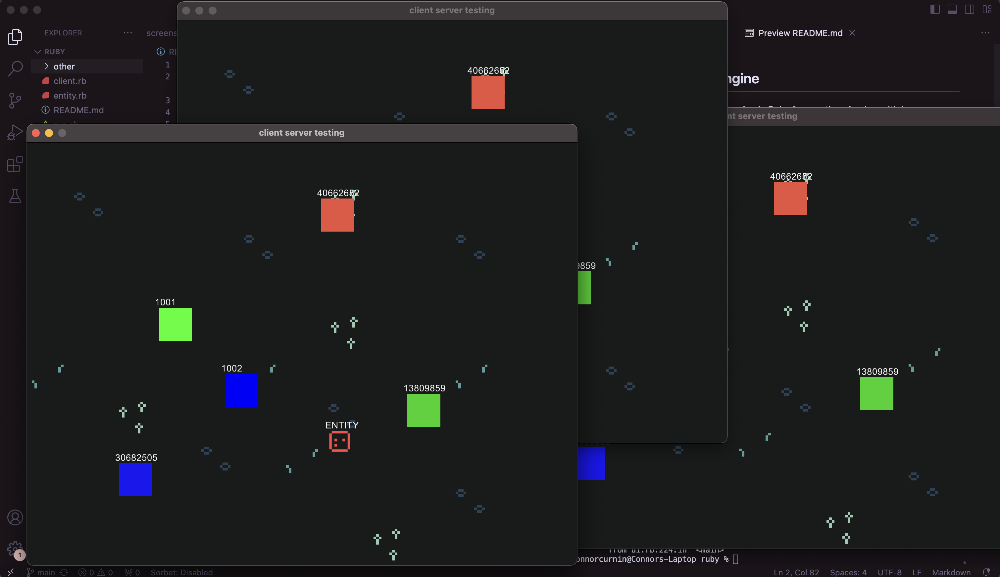

## Ruby Multiplayer Engine
Building a lightweight game engine in Ruby for creating simple multiplayer games.

### client.rb
Simple TCPSocket that sends and receives data.
### server.rb
Simple TCPServer that sends and receives data and stores information about server-side or "overworld" entities.
### ui.rb
Gosu UI that allows player to control movement. Each instance of the UI creates an instance of the client and connects to the server. The ui uses the client to send position, "player name" (id), and color data to the server. It also sends data to the server if it has "killed" an overworld entity (triggered by collision). The ui reads data from the server to see if any of the other connected clients have killed an overworld entity.
### entity.rb
Simple abstraction for entity, but will need to be abstracted further up (current version more closely represents a player)
### spritesheet.rb
Simple spritesheet class, needs to be cleaned up, but works within entity class.
### tilesheet.rb
Similar to the spritesheet class, but takes tilemap in. 2d array is used to draw tiles based on tilesheet. This 2d array will be stored server side.
### camera.rb
Small camera class built on top of Gosu.translate that focuses on the passed object (in this case, the player/entity).

### To Do:
- Update data communication to send marshl'd entity object data, this data will be stored in simpler structures on the client and server ends: {entity_id => [entity object]}